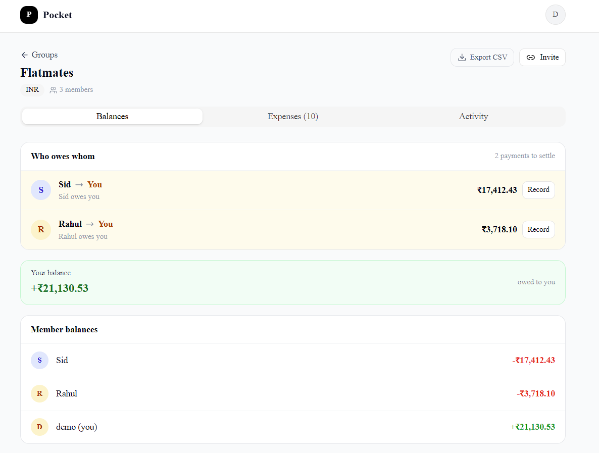

# Case 2: Pocket — Roommate Expense Splitter

[](LICENSE)

**Live demo:** <https://pocket-oxq4.vercel.app/>
**Repo:** <https://github.com/Pratham061204/pocket>
**Demo video:** <PASTE_YOUR_DEMO_VIDEO_LINK_AFTER_RECORDING>

> **Demo login:** Click **"Try Demo Account"** on the login page — no sign-up needed.

---

## What this is

A group expense splitter for roommates and shared households: add an expense, choose who paid and how to split it (equally, by amount, or by percentage), and the app tells you — in one glance — exactly who owes whom and how much. It minimizes the number of bank transfers needed to settle the group using a greedy netting algorithm.

---

## How to run locally

1. `git clone https://github.com/Pratham061204/pocket.git`
2. `cd pocket && npm install`
3. Copy `.env.local.example` to `.env.local` and fill in your Supabase URL, anon key, and DB connection strings
4. `npx prisma db push && npx prisma db seed`
5. `npm run dev` → open <http://localhost:3000>

### Environment variables

| Variable | Description |
|---|---|
| `NEXT_PUBLIC_SUPABASE_URL` | Supabase project URL |
| `NEXT_PUBLIC_SUPABASE_ANON_KEY` | Supabase anon/public key |
| `DATABASE_URL` | Postgres connection string (pooled, port 6543) |
| `DIRECT_URL` | Postgres direct connection string (port 5432) |
| `NEXT_PUBLIC_SITE_URL` | Deployed URL (for auth redirects) |

---

## Stack

| Layer | Choice | Why |
|---|---|---|
| Framework | Next.js 16 App Router + Server Actions | Co-locates data fetching with UI; no separate API layer needed |
| Database | PostgreSQL via Supabase | Free hosted Postgres; relational integrity required for the netting logic |
| ORM | Prisma | Type-safe migrations and readable relation syntax — fastest DX for rapid iteration |
| Auth | Supabase Auth (magic link + demo account) | Same SDK as the DB; zero extra cost or config |
| Styling | Tailwind CSS v4 | Utility-first; ships with the headless component library used |
| Deployment | Vercel | Zero-config Next.js deploys; free tier sufficient |

---

## What's NOT done

- **Email notifications** — "you owe X" alerts need a queue (Resend/Postmark); out of scope for the time box.
- **Push notifications** — requires a service worker and VAPID keys; not justified for a 1-day build.
- **Expense editing** — delete + re-add covers the use case; editing adds significant UI and audit-trail complexity.
- **Group deletion** — destructive with cascading debt implications; soft-delete on expenses is already in place.

---

## In production, I would also add

- Snapshot the exchange rate at the moment of expense entry (currently converts at submission time, which is correct, but the rate itself is not stored — re-running the calculation later would silently change settled debts).
- Replace the lazy recurring-expense generation (triggered on page load) with a proper scheduled job via Vercel Cron Jobs.
- Proactive email or push notification when a balance crosses a user-defined threshold (e.g. "Rahul now owes you ₹2,000").
- Banker's rounding (round-half-to-even) with per-transaction remainder tracking to prevent ₹0.01 drift across many splits.
- End-to-end tests (Playwright) covering the netting algorithm with known fixed inputs to prevent regression.

---

## How the netting algorithm works

Given net balances for each person, the algorithm minimizes the number of transactions needed to settle everyone using a greedy two-pointer approach:

1. Compute each person's **net balance** (total paid − total owed across all expenses and settlements)
2. Split into two lists: **creditors** (net > 0) and **debtors** (net < 0), sorted by magnitude
3. Greedily match the largest debtor to the largest creditor — one transaction clears as much debt as possible
4. Repeat until all balances are zero

**Example — 3 people:**
```
Alice paid ₹1200 (split 40/30/30) → Alice +₹840, Bob −₹360, Carol −₹480
Bob paid ₹600 (split equal)       → Alice −₹200, Bob +₹400, Carol −₹200

Net: Alice +₹640, Bob +₹40, Carol −₹680

Algorithm output (2 transactions instead of naive 3):
  Carol → Alice  ₹640
  Carol → Bob    ₹40
```

Implemented in `src/lib/balance.ts`. O(n log n) vs. the exact minimum-transactions problem which is NP-hard.

---

## Screenshot

<!-- Add a screenshot: take one of the Flatmates group → Balances tab, save as docs/screenshot.png, commit & push -->

